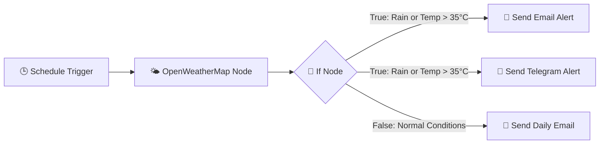

# 🌤️ Smart Weather Alerting System


An automated, event-driven workflow built with **n8n** that monitors daily weather forecasts for Vellore and dispatches multi-channel alerts via **Gmail** and **Telegram** based on dynamic ambient conditions.

---

## 📸 Workflow Preview


---

## 📌 Project Overview

This project automates daily weather monitoring to eliminate the manual hassle of checking forecast apps every morning. Operating on a scheduled trigger, it fetches real-time meteorological metrics, evaluates weather conditions against threshold rules, and routes targeted notifications:

- **Urgent Conditions (Rain / High Heat > 35°C):** Dispatches an immediate action-oriented alert via Telegram alongside a detailed HTML email warning.
- **Normal Conditions (Clear Sky / Mild Temp):** Delivers a clean, styled daily forecast email without triggering unnecessary chat alerts.

---

## 🏗️ Workflow Architecture



> Renders natively as a diagram on GitHub — no manual ASCII spacing required.

---

## 📱 Notification Previews

| Telegram Rain Alert | Gmail Daily Forecast Email |
| :---: | :---: |
| 

 |

---

## 🧩 Nodes & Configuration Breakdown

| Node Name | Node Type | Purpose & Usage |
| :--- | :--- | :--- |
| **Schedule Trigger** | `n8n-nodes-base.scheduleTrigger` | Automates execution daily at **9:01 AM** to ensure timely morning updates. |
| **OpenWeatherMap** | `n8n-nodes-base.openWeatherMap` | Connects to the OpenWeatherMap API to retrieve real-time temperature, humidity, wind, and weather descriptions for **Vellore**. |
| **If** | `n8n-nodes-base.if` | Evaluates two condition branches using an `OR` combinator: <br>1. `weather[0].main` contains `"Rain"` <br>2. `main.temp` is `> 35°C` |
| **Send Email Alert (True)** | `n8n-nodes-base.gmail` | Sends a formatted HTML email warning about rain or extreme heat when the `If` node evaluates to `True`. |
| **Send Telegram Alert (True)** | `n8n-nodes-base.telegram` | Sends a direct message to a designated Telegram chat with clear action steps (e.g., carrying rain gear). |
| **Send Daily Email (False)** | `n8n-nodes-base.gmail` | Delivers a standard daily weather summary HTML email when conditions are normal (`False`). |

---

## 🛠️ Real Engineering Challenges & Solutions

### 1. Incorrect Branch Execution & Node Wiring
- **Challenge:** The Telegram node was initially chained after the `False` branch email node (`Send Daily Email`), causing it to execute during clear weather and skip during actual rain alerts.
- **Solution:** Re-wired the Telegram node input dot directly to the **`True` output branch** of the `If` node. This ensured both the alert email and Telegram text execute in parallel only when weather thresholds are met.

### 2. Missing Context / Blank Dynamic Variables in Manual Node Testing
- **Challenge:** When testing the Telegram node independently via "Execute Step", weather variables like `Condition` and `Temperature` rendered as blank values because no upstream payload was active on that specific branch.
- **Solution:** Standardized n8n JSON expressions by explicitly referencing the root node payload:
  ```
  {{ $('OpenWeatherMap').item.json.weather[0].description }}
  ```

### 3. Vague Alert Messaging (Rain vs. High Heat Confusion)
- **Challenge:** Combining rain and high heat into a single static message left the user confused about whether to bring a raincoat or prepare for severe heat.
- **Solution:** Implemented JavaScript inline ternary logic directly inside the Telegram text expression to dynamically output targeted action instructions based on the forecast string:
  ```javascript
  {{ $('OpenWeatherMap').item.json.weather[0].main.toLowerCase().includes('rain') 
      ? '☔ Rain expected today! Please carry a raincoat or umbrella to protect your work.' 
      : '☀️ High temperature alert today. Stay hydrated!' }}
  ```

### 4. Unwanted Platform Branding
- **Challenge:** Default n8n Telegram node settings appended *"This message was sent automatically with n8n"* at the bottom of notifications.
- **Solution:** Disabled the `appendAttribution` setting under **Additional Fields** in the Telegram node configuration to maintain a clean presentation.

---

## 🚀 Roadmap & Futuristic Upgrades

- [ ] **Multi-City Forecast Support** — Expand node expressions to iterate over an array of custom city inputs.
- [ ] **Air Quality Index (AQI) Integration** — Integrate OpenWeatherMap AQI endpoints to warn users about high pollution levels.
- [ ] **Interactive Telegram Bot Commands** — Upgrade the Telegram integration from passive alerts to a bi-directional bot accepting commands like `/weather` or `/forecast`.
- [ ] **Webhook Trigger Integration** — Allow external calendar events (e.g., travel schedules) to trigger localized weather checks dynamically.

---

## 📦 How to Import & Run

1. Clone this repository to your local machine:
   ```bash
   git clone https://github.com/vasanth-dotcom/n8n-weather-alert-system.git
   ```
2. Open your n8n instance dashboard.
3. Click **Workflows → Import from File** and select `Smart Weather Alerting System.json`.
4. Configure your credentials for:
   - OpenWeatherMap API
   - Gmail OAuth2
   - Telegram Bot API
5. Toggle the workflow to **Active / Published**.
